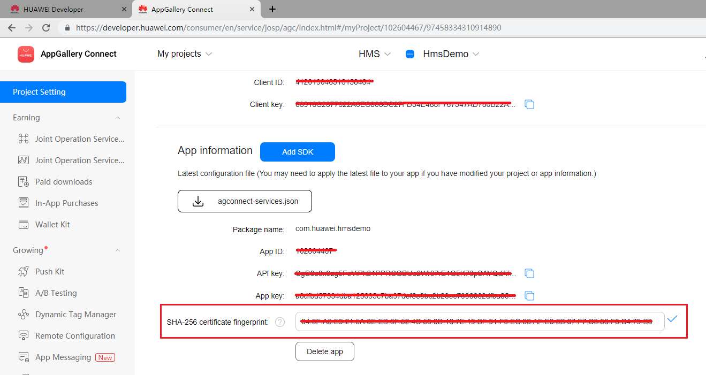

# IAP Kit (HMS)

## Service Introduction

HUAWEI In-App Purchases (IAP) enables you to sell digital products and content directly within your app. To make in-app purchases available in your app, you only need to integrate the IAP SDK and then call its API to launch the IAP checkout screen.

To learn how to integrate it, watch the coding practice tutorial [here](https://developer.huawei.com/consumer/en/training/detail/101583014863994176).

With IAP, you can offer the following types of digital products and content within your app:

- One-time products: Users can purchase with a single, non-recurring charge. There are two types of one-time products.
    - Consumables: Such products are depleted as they are used and can be purchased again, for example, in-game currencies and items.
    - Non-consumables: Such products are purchased once and never expire, for example, extra game levels in a game or permanent membership of an app.
- Subscriptions: They provide users with ongoing access to content or services in your app. Users are charged on a recurring basis until they decide to cancel. Examples include non-permanent memberships of an app, such as a monthly video membership.

### Supported Devices

| <div style="width:80px">Device Type</div>                       | OS Version                | HMS Core（APK）Version                                                     |
  | ------------------------------------------------------------ | ----------------------- | ------------------------------------------------------------ |
  | Huawei phones and tablets | EMUI 3.0 or later                   | 3.0.0 or later |
  | Non-Huawei Android phones | Android 4.4 or later (API level 19 or higher)             | 3.0.0 or later                         |
  | HUAWEI Vision| HarmonyOS                    | 5.0.0 or later |

### Checkout Screens

- On the phone/tablet (The checkout screens on the phone and tablet only differ in their sizes. Here, the checkout screen on the phone is used as an example.)<br>
  

- On the HUAWEI Vision<br>
  

### Service Features

- Easy access and sandbox testing<br>
Comprehensive access procedure guidance and sandbox testing configuration are provided so that you can quickly and easily access HUAWEI IAP.

- Localized languages and currencies for a convenient worldwide release<br>
Your app shows product information and its price in the language and currency of the country or region where the user's account is located. All you have to do is just releasing an app, and then the app will be promoted within [Supported Countries/Regions](https://developer.huawei.com/consumer/en/doc/development/HMSCore-Guides/huawei-iap-coverage-0000001050438753).

- Multiple payment methods aggregated for global payments<br>
Users can pay with bank cards, Alipay, WeChat, Direct Carrier Billing (DCB), and HUAWEI Points. The bank cards include those issued by major banks in China as well as Visa and Mastercard. DCB is supported by many large carriers outside China. Users can bind their bank cards and phone numbers to their HUAWEI IDs and make payments by entering HUAWEI ID payment passwords they have set before, which is more convenient than traditional payment methods.<br>
The following table lists supported payment methods.

| <div style="width:80px">Country/Region</div> | Supported Payment Method                                                     |
| -------------------------------------- | ------------------------------------------------------------ |
| Chinese mainland                               | Bank card<br>Alipay<br>WeChat Pay<br>HUAWEI Points |
| Hong Kong (China), Macao (China), Taiwan (China), and countries/regions outside China                               | Bank card<br>DCB<br>HUAWEI Points<br>Third-party payment<br>|

- High security, high reliability, and 24/7 monitoring
    - The TLS protocol is used to encrypt data for transmission and the RSA algorithm is used for signatures to protect user messages from being intercepted or tampered with. Data is encrypted and anonymized before being saved in the background, ensuring data security.
    - Cluster deployment and redundancy design are adopted for background servers, and 24/7 real-time system monitoring can facilitate locating a fault and providing assistance for operations.

### Use Cases
HUAWEI IAP provides a Product Management System (PMS) through AppGallery Connect for you to manage your products after adding their information including ID and price. Your app with HUAWEI IAP integrated will display the product information in the local language and also show the price in the local currency based on the location and exchange rate, facilitating global distribution for your app.

The latest version supports the following functions.

- Release: You can release an app (gaming app or other) with one package and manage the prices and languages of in-app products. The countries/regions supported by the PMS on the price configuration page shall prevail.
- Currencies and languages: You can set one default currency and one default language for each country/region. Only one language is allowed for a country/region.
- Price: Huawei provides an in-app product reference price for each country/region based on the price (tax included) you set and the exchange rate. You can change the reference price for each country/region as needed. For example, if you enter one euro, the system automatically sets the prices for other countries/regions based on the exchange rate. If Euro to CNY rate is 7.88, the system automatically sets the price for China to CNY7.88. You can change the price as needed.
- Exchange rate: The PMS provides fixed exchange rates by which Huawei will update prices. Exchange rate updates by Huawei have no affect on your product prices. You should manually change your product prices if needed.
- Intended audience: The PMS is available for global developers. To release an app (gaming app or other) to multiple countries/regions, you need to manage the price and language of the products locally.

### Function Usage Restrictions

| <div style="width:80px">Function</div> | Location Requirement                                                     |
| -------------------------------------- | ------------------------------------------------------------ |
| Sandbox testing on the HUAWEI Vision                               | Supported only outside the Chinese mainland. |

### Supported Countries/Regions
HUAWEI IAP is now available in [these countries/regions](https://developer.huawei.com/consumer/en/doc/development/HMSCore-Guides/huawei-iap-coverage-0000001050438753).

### Privacy Statement
Before integrating IAP into your app, you will need to sign the [HUAWEI Developers Service Agreement](https://developer.huawei.com/consumer/en/doc/start/agreement-0000001052728169) and [Agreement on Use of Huawei APIs](https://developer.huawei.com/consumer/en/doc/distribution/app/10129). You understand and accept that downloading or using the said kit will be deemed as you having agreed to all of the preceding agreements, and you will fulfill and assume the legal responsibilities and obligations in accordance with said agreements.

## Integrating into Your Unreal Project

### Register and get verified

Before you get started, you must register as a HUAWEI developer and complete identity verification on the [HUAWEI Developer website](https://developer.huawei.com/consumer/en). For details, please refer to [Register a HUAWEI ID](https://developer.huawei.com/consumer/en/doc/10104).


### Create an app
Create an app by referring to [Creating a Project](https://developer.huawei.com/consumer/en/doc/development/AppGallery-connect-Guides/agc-get-started#createproject) and [Creating an App in the Project](https://developer.huawei.com/consumer/en/doc/development/AppGallery-connect-Guides/agc-get-started#createapp). Set the following parameters as described:
- Platform: Select Android
- Device: Select Mobile phone
- App category: Select App or Game


Now you have your Huawei HMS Project and App information. Next, you need to enable IAP service and configure the IAP Parameters

1. Enabling IAP
    
    To use IAP, [enable this service](https://developer.huawei.com/consumer/en/doc/distribution/app/agc-help-enabling-service-0000001146598793#EN-US_TOPIC_0000001146598793__en-us_topic_0000001064950324_section135355454314) first.

2. Setting IAP Parameters

    To use the HUAWEI in-app payment function, you need to [set IAP Parameters](https://developer.huawei.com/consumer/en/doc/development/HMSCore-Guides/config-agc-0000001050033072).

### Prepare for development

According to [HMS integration process introduction](https://developer.huawei.com/consumer/en/codelab/HMSPreparation/index.html#6), we still need to add some configurations to the gradle files for development preparations.


1. Install the Plugin

   Copy and enable the Unreal Engine Plugin.

   If a `<unreal_project_directory>/Plugins` folder does not exist, create it.

   From the Huawei IAP Unreal plugin, copy the HuaweiIAP folder and its contents to `<unreal_project_directory>/Plugins`.
   

   From your Unreal Editor, select **Edit -> Plugins** menu then enable the Huawei IAP Plugin.
   

2. Signing Certificate Fingerprint

   Please refer to Huawei [preparation documentation step 4](https://developer.huawei.com/consumer/en/codelab/HMSPreparation/index.html#3) for generating a SHA256 Certificate Fingerprint.

   

   And refer to Huawei [preparation documentation step 5](https://developer.huawei.com/consumer/en/codelab/HMSPreparation/index.html#4) to add Fingerprint to AppGallery Connect.

   

3. Package name

   Set the package name in **Edit -> Project Settings -> Android -> APK Packaging -> Android Package Name**

   The package name is `com.${Company Name}.${Product Name}`.

   You can also complete the rest of the settings here, such as version number, icons, resolution, etc. 

   

4. Set up plugin

   - Sign in to [AppGallery Connect](https://developer.huawei.com/consumer/en/service/josp/agc/index.html) and click **My projects**.
   - Find your app project and click the app that needs to integrate the HMS Core SDK.
   - Go to **Project settings > General information**. In the App information area, download the `agconnect-services.json` file.
   
   - You can put the json file under `<unreal_project_directory>/Configs/AGC` as default (create the `Configs/AGC` directory if not existed) or in your own favorite path
   - Go to **Earn > In-App Purchases** and find the **IAP public key** for your app.
    
   - In your Unreal Editor, select **Edit -> Project Settings -> Plugins -> HuaweiIAP** then set up the `agconnect-services.json` file path and `IAP public key`.
   


## Developing with the SDK

### Developing

#### Using Blueprint
The below functions are supported with Blueprint
- `checkEnviroment`
- `queryProducts`
- `queryPurchases`
- `getPurchasedRecords`
- `buyProduct`
You can refer to the [Blueprint sample](Blueprint/HuaweiIap.uasset).


#### Using C++ APIs
Access the Huawei IAP APIs by including the header file `Iap.h` in the related classes of your project.

```C++
#include "Iap.h"
```

Huawei IAP supported 3 types:

| <div style="width:80px">Type</div>                       | Description                | 
  | ------------------------------------------------------------ | ----------------------- |
  | IN_APP_CONSUMABLE | Consumable product |
  | IN_APP_NONCONSUMABLE | Non consumable product |
  | IN_APP_SUBSCRIPTION | Subscription product |


- Checking the support for Huawei IAP 

```C++
huawei::Iap::checkEnviroment();
```
- Query products configured in AppGallery Connect
To query the products, you need to specify the product IDs and type.

Sample code
```C++
TArray<FString> productIds;
productIds.Init("productId１", "productId2", "productId3");
huawei::Iap:queryProducts(productIds, IN_APP_CONSUMABLE);
```

- Query purchase data of the products that bought by user.

Sample code
```C++
huawei::Iap::queryPurchases(IN_APP_CONSUMABLE);
```
- Buy a product

Sample code
```C++
huawei::Iap::buyProduct("productId1", IN_APP_CONSUMABLE);
```

- Query the purchased records

Sample code
```C++
huawei::Iap::getPurchasedRecords(IN_APP_CONSUMABLE)
```

- Listen to callback events
Implement a listener class to receive information in all the IAP callback events

Action types table:
| <div style="width:80px">Type</div>                       | Description                | 
  | ------------------------------------------------------------ | ----------------------- |
  | CHECK_ENVIRONMENT | Check the support for Huawei IAP |
  | QUERY_PRODUCTS | Query products configured on Huawei AppGalleryConnect |
  | BUY_PRODUCT | Buy the product |
  | QUERY_PURCHASES | Query the purchased data |
  | GET_PURCHASES_RECORDS | Get the purchased records |

Sample code
Header file
```C++
class YourIapListener : public huawei::IapListener {
public:
    YourIapListener();
    
    void onCheckEnvironmentSuccess();
    void onException(int action, const FString message);
    void onObtainProductList(const TArray<ProductInfo> products, int type);
    void onPurchaseSuccess(const FString productId, int type);
    void onObtainPurchases(const TArray<InAppPurchaseData> purchasedProductDatas, const TArray<InAppPurchaseData> nonPurchasedProductDatas, int type);
    void onObtainPurchasedRecords(const TArray<InAppPurchaseData> purchasedProductDatas, int type);
}  
```

Then set it with the `setListener` API

Sample code
```C++
huawei::Iap::setListener(new YourIapListener());
```

You can refer to Huawei documation for the [ProductInfo](https://developer.huawei.com/consumer/en/doc/development/HMSCore-References/productinfo-0000001050135784) and [InAppPurchaseData](https://developer.huawei.com/consumer/en/doc/development/HMSCore-References/inapppurchasedata-0000001050137635).


### Test & Release

Please refer to Huawei [integration procedure](https://developer.huawei.com/consumer/en/doc/start/htiHMSCore) for testing and releasing.


